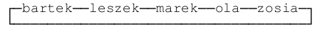

###TASK:

S1 precedes s2 if the last letter of s1 is " less”
from the first letter S2. This is the rule for placing 
strings in a cyclic list, for example:

Please write the appropriate type definitions and a function 
to insert into the list new string. To the function you must pass
a pointer to the list and a string to be inserted. Function should
return a boolean value that indicates whether a string was 
successfully inserted into the list. After insertion
item pointer to the list should point to the newly inserted item.