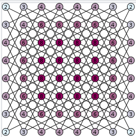
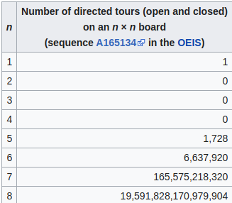

###TASK: Knight's tour puzzle

Algorithm description: [URI](https://en.wikipedia.org/wiki/Knight%27s_tour)

Because of large number of iterations "brute force" algorithm is not efficient for
n > 8 (For n = 8 it is pretty speedy if starts from right element.)

