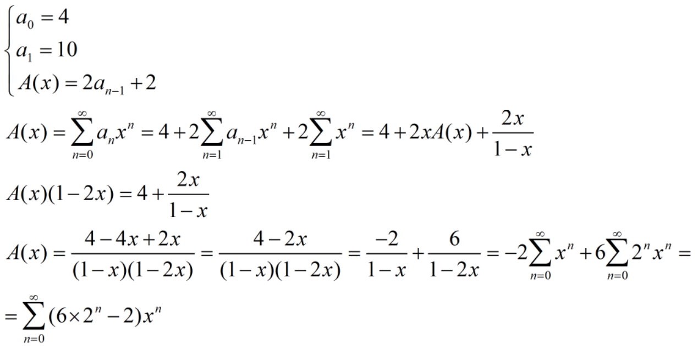

## Binary Search Tree

```C
struct node {
    int val;
    node* left;
    node* right;
};
```

### Tasks:
1. Write functions recursively:
    1. Insert new node in tree.
    2. Write all tree elements.
    3. Count all (non leaf) elements.
    4. Get tree height.
    5. Count leaf elements.
    6. Count nodes on n layer.
    7. Check if value is in tree.
    8. Delete tree from memory.
    9. Delete nodes after n layer.
    
2. Write functions from 1. iteratively.
    
#### Print tree function comment: :page_with_curl:
How number of _ is being calculated:

```Text
     ____54____            
    /          \ 
   13          33      
  /  \        /  \
10    20    40    50
  
  
  
           __________54_________              h = 1  l = 0  k = 1  (4 - 0 - 3)
          /                     \  
     ____53____              ____90____       h = 2  l = 1  k = 0  (4 - 1 - 3)
    /          \            /          \     
   13          33          70          95     h = 3  l = 2  k < 0   
  /  \        /  \        /  \        /  \  
10    20    40    50    69    71    83    99  h = 4  l = 3  k < 0  

Итого: a(k) = 2^k*6-2 - the number of _ preceding the number (given that the number occupies 2 positions)
       a(n) = 6 * 2^(total_h - layer_n - 3) - 2


                       ______________________50______________________
                      /                                              \ 
           __________25__________                          __________75__________   
          /                      \                        /                      \ 
     ____15____              ____40____              ____65____              ____90____    
    /          \            /          \            /          \            /          \  
   10          17          35          45          55          70          80          95
  /  \        /  \        /  \        /  \        /  \        /  \        /  \        /  \ 
09    11    16    18    34    36    44    46    54    56    69    71    79    81    94    99   
```


